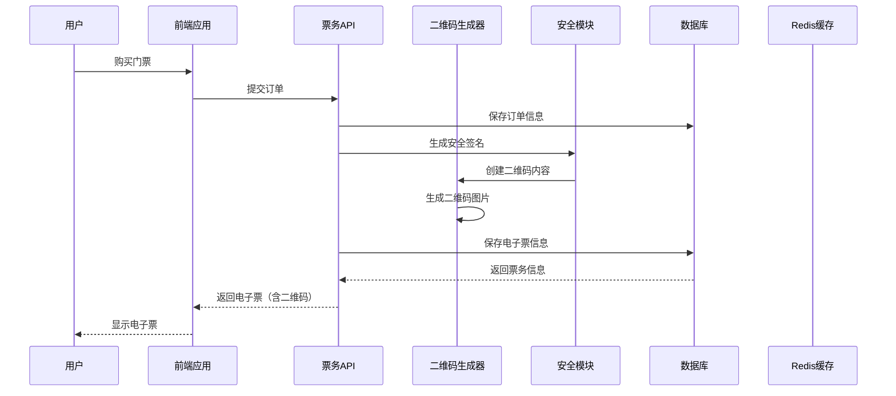
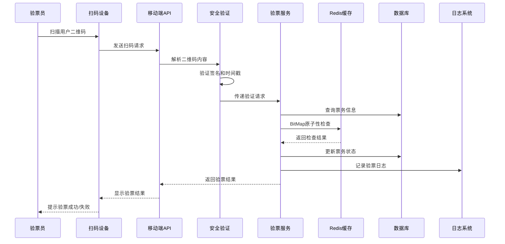

# LiveHouse扫码验票系统工作流程指南

## 系统概述

LiveHouse票务系统现在已经升级为完整的扫码验票解决方案，支持：
- 二维码生成和验证
- 移动端扫码验票
- PDA设备集成
- 第三方验票设备
- 批量验票处理
- 完整的安全防护机制

## 业务流程

### 1. 票务生成流程



**详细步骤：**
1. 用户完成订单支付
2. 系统调用 `generateElectronicTickets()` 方法
3. 为每张票生成唯一ID和验证码
4. 使用安全模块生成包含时间戳的数字签名
5. 生成包含以下信息的二维码：
   - 票务ID
   - 验证码
   - 演出ID
   - 用户ID
   - 时间戳
   - 数字签名
6. 将二维码图片（Base64）保存到数据库

### 2. 现场验票流程



## API接口说明

### 3.1 传统验票接口（兼容现有系统）
```http
POST /ticket/verify/{ticketCode}
```

### 3.2 新增扫码验票接口

#### 移动端扫码验票
```http
POST /mobile/ticket/scan-verify
Content-Type: application/json

{
  "qrCodeContent": "二维码JSON内容",
  "deviceType": "mobile",
  "operatorId": "操作员ID",
  "location": "验票地点"
}
```

#### PDA设备验票
```http
POST /mobile/ticket/pda-verify
Content-Type: application/json

{
  "qrCodeContent": "二维码JSON内容",
  "deviceId": "PDA设备ID",
  "operatorId": "操作员ID"
}
```

#### 第三方设备验票
```http
POST /mobile/ticket/third-party-verify
Content-Type: application/json
X-API-Key: your-api-key

{
  "qrCodeData": "二维码数据",
  "deviceId": "设备ID",
  "deviceModel": "设备型号",
  "vendor": "设备厂商",
  "firmwareVersion": "固件版本"
}
```

#### 批量验票
```http
POST /mobile/ticket/batch-verify
Content-Type: application/json

{
  "qrCodes": ["二维码1", "二维码2", "..."],
  "operatorId": "操作员ID"
}
```

## 安全机制

### 4.1 数字签名验证
- 使用SHA-256算法生成签名
- 签名包含票务信息 + 密钥
- 防止二维码伪造

### 4.2 时间戳验证
- 二维码包含生成时间戳
- 默认30分钟有效期（可配置）
- 防止二维码复制和重放攻击

### 4.3 Redis BitMap防重复
- 使用票务ID作为BitMap位置
- 原子性操作防止并发重复验票
- 支持大规模票务并发处理

### 4.4 API Key认证
- 第三方设备需要API Key
- 支持多密钥管理
- 请求频率限制

## 设备集成方案

### 5.1 移动端App集成

**Android集成示例：**
```java
// 扫码验票
public class TicketScanner {
    private static final String BASE_URL = "http://your-server.com/mobile/ticket/";
    
    public void scanAndVerify(String qrCode) {
        ScanRequest request = new ScanRequest();
        request.setQrCodeContent(qrCode);
        request.setDeviceType("mobile");
        request.setOperatorId(getCurrentOperatorId());
        
        // 发送HTTP请求
        retrofitService.scanVerify(request)
            .enqueue(new Callback<VerifyResponse>() {
                @Override
                public void onResponse(Call<VerifyResponse> call, Response<VerifyResponse> response) {
                    if (response.isSuccessful()) {
                        showVerifySuccess(response.body());
                    } else {
                        showVerifyError(response.message());
                    }
                }
                
                @Override
                public void onFailure(Call<VerifyResponse> call, Throwable t) {
                    showNetworkError(t.getMessage());
                }
            });
    }
}
```

**iOS集成示例：**
```swift
class TicketScanner {
    let baseURL = "http://your-server.com/mobile/ticket/"
    
    func scanAndVerify(qrCode: String) {
        let request = ScanRequest(
            qrCodeContent: qrCode,
            deviceType: "mobile",
            operatorId: getCurrentOperatorId()
        )
        
        // 发送HTTP请求
        APIManager.shared.post(endpoint: "scan-verify", body: request) { result in
            DispatchQueue.main.async {
                switch result {
                case .success(let response):
                    self.showVerifySuccess(response)
                case .failure(let error):
                    self.showVerifyError(error)
                }
            }
        }
    }
}
```

### 5.2 PDA设备集成

**Java集成示例（适用于Android PDA）：**
```java
public class PDATicketScanner {
    private final String API_URL = "http://your-server.com/mobile/ticket/pda-verify";
    private final String DEVICE_ID = android.os.Build.SERIAL;
    
    public void processScan(String scanResult) {
        try {
            JSONObject requestBody = new JSONObject();
            requestBody.put("qrCodeContent", scanResult);
            requestBody.put("deviceId", DEVICE_ID);
            requestBody.put("operatorId", getCurrentOperatorId());
            
            // 发送POST请求
            HttpURLConnection conn = (HttpURLConnection) new URL(API_URL).openConnection();
            conn.setRequestMethod("POST");
            conn.setRequestProperty("Content-Type", "application/json");
            conn.setDoOutput(true);
            
            try (OutputStream os = conn.getOutputStream()) {
                os.write(requestBody.toString().getBytes());
            }
            
            // 处理响应
            int responseCode = conn.getResponseCode();
            if (responseCode == 200) {
                // 解析成功响应
                Scanner scanner = new Scanner(conn.getInputStream());
                String response = scanner.nextLine();
                processVerifyResult(response);
            } else {
                showError("验票失败：" + conn.getResponseMessage());
            }
            
        } catch (Exception e) {
            showError("网络错误：" + e.getMessage());
        }
    }
    
    private void processVerifyResult(String response) {
        try {
            JSONObject result = new JSONObject(response);
            if (result.getBoolean("success")) {
                showSuccessMessage("验票成功");
                playSuccessSound();
            } else {
                showErrorMessage(result.getString("errorMsg"));
                playErrorSound();
            }
        } catch (Exception e) {
            showError("数据解析错误");
        }
    }
}
```

### 5.3 第三方设备集成

**通用HTTP客户端示例：**
```python
import requests
import json

class ThirdPartyTicketDevice:
    def __init__(self, api_key, device_info):
        self.api_key = api_key
        self.device_info = device_info
        self.base_url = "http://your-server.com/mobile/ticket/"
    
    def verify_ticket(self, qr_code_data):
        url = self.base_url + "third-party-verify"
        headers = {
            "Content-Type": "application/json",
            "X-API-Key": self.api_key
        }
        
        payload = {
            "qrCodeData": qr_code_data,
            "deviceId": self.device_info["device_id"],
            "deviceModel": self.device_info["model"],
            "vendor": self.device_info["vendor"],
            "firmwareVersion": self.device_info["firmware_version"]
        }
        
        try:
            response = requests.post(url, headers=headers, json=payload, timeout=30)
            
            if response.status_code == 200:
                result = response.json()
                if result.get("success"):
                    self.handle_verify_success(result["data"])
                else:
                    self.handle_verify_error(result["errorMsg"])
            else:
                self.handle_network_error(f"HTTP {response.status_code}")
                
        except requests.exceptions.RequestException as e:
            self.handle_network_error(str(e))
    
    def handle_verify_success(self, data):
        print("✓ 验票成功")
        # 设备特定的成功处理逻辑
        
    def handle_verify_error(self, error_message):
        print(f"✗ 验票失败: {error_message}")
        # 设备特定的错误处理逻辑
        
    def handle_network_error(self, error_message):
        print(f"⚠ 网络错误: {error_message}")
        # 设备特定的网络错误处理逻辑

# 使用示例
device = ThirdPartyTicketDevice(
    api_key="your-api-key-here",
    device_info={
        "device_id": "DEVICE001",
        "model": "Scanner-Pro-X1",
        "vendor": "TechCompany",
        "firmware_version": "1.2.3"
    }
)

# 扫码验票
device.verify_ticket(scanned_qr_code)
```

## 部署配置

### 6.1 应用配置

在 `application-ticket.yml` 中配置：

```yaml
ticket:
  security:
    secret-key: "your-production-secret-key"
    qr-validity-minutes: 30
  
  third-party:
    api-keys: "key1,key2,key3"
    rate-limit-per-minute: 100
  
  verification:
    enable-batch-verify: true
    max-batch-size: 50
```

### 6.2 数据库修改

需要为 `tb_electronic_ticket` 表添加二维码字段：

```sql
ALTER TABLE tb_electronic_ticket 
ADD COLUMN qr_code_data TEXT COMMENT '二维码数据（Base64编码）';
```

### 6.3 Redis配置

确保Redis支持BitMap操作：

```yaml
spring:
  redis:
    host: your-redis-host
    port: 6379
    password: your-password
    lettuce:
      pool:
        max-active: 20
        max-idle: 10
```

## 监控和日志

### 7.1 验票统计
- 总验票次数
- 成功率统计
- 设备使用统计
- 操作员工作量统计

### 7.2 异常监控
- 伪造票据尝试
- 重复验票尝试
- 系统错误监控
- 网络异常统计

### 7.3 性能监控
- API响应时间
- 并发处理能力
- Redis命中率
- 数据库查询性能

## 故障排除

### 8.1 常见问题

**问题：二维码扫描后提示"已过期"**
- 检查系统时间是否正确
- 确认 `qr-validity-minutes` 配置
- 验证时间戳生成逻辑

**问题：第三方设备无法连接**
- 检查API Key是否有效
- 确认网络连接
- 验证设备白名单配置

**问题：验票响应慢**
- 检查Redis连接
- 优化数据库查询
- 增加连接池大小

### 8.2 调试工具

使用二维码解析接口进行调试：
```http
POST /mobile/ticket/parse-qr
{
  "qrCodeContent": "待解析的二维码内容",
  "imageFormat": false
}
```

## 最佳实践

1. **安全性**
   - 定期更换签名密钥
   - 监控异常验票行为
   - 启用HTTPS传输

2. **性能优化**
   - 使用Redis集群
   - 配置适当的连接池
   - 实施API限流

3. **用户体验**
   - 提供清晰的错误提示
   - 支持离线验票缓存
   - 优化扫码响应速度

4. **运维管理**
   - 定期备份验票数据
   - 监控系统资源使用
   - 建立应急响应机制